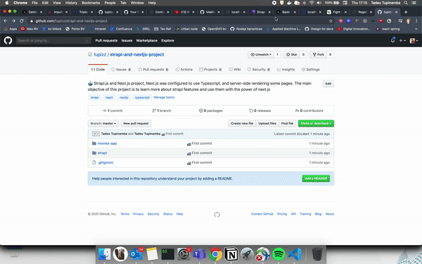

# Next.js and Strapi

🤖 Strapi.js and Next.js project, Next.js was configured to use Typescript, and server-side rendering some pages. The main objective of this project is to learn more about strapi features and use them with the power of next.js

# GIF

